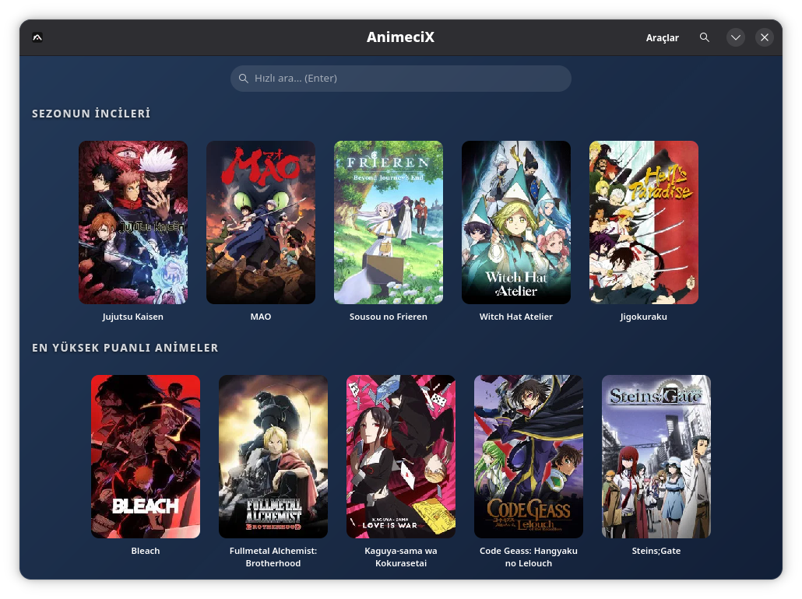
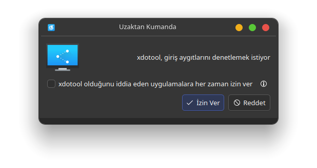
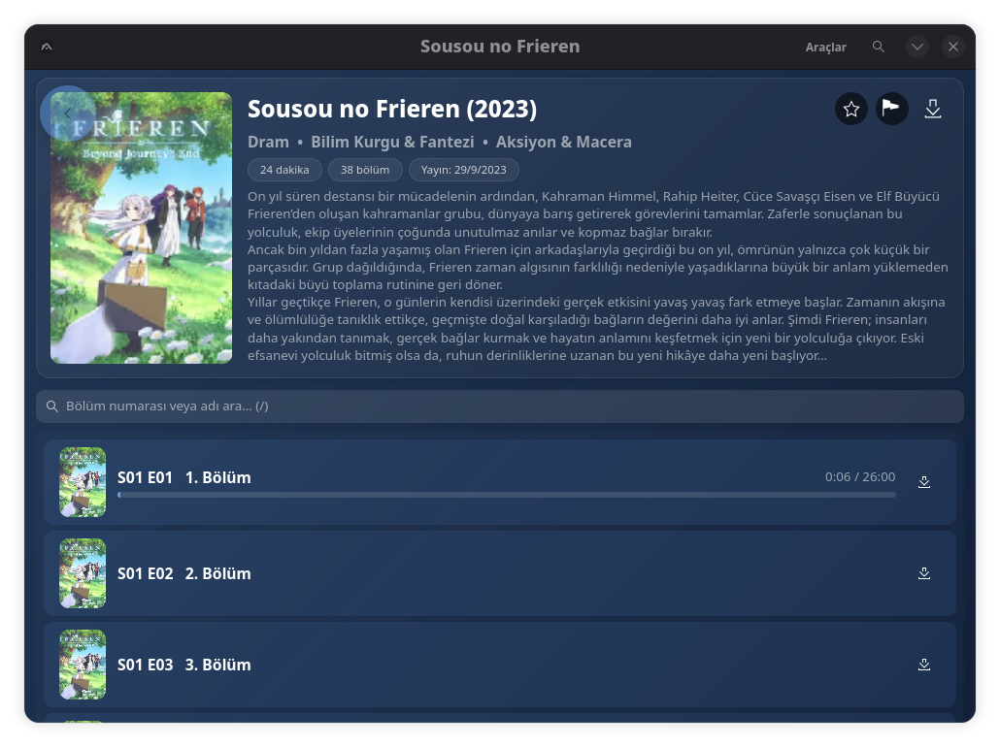
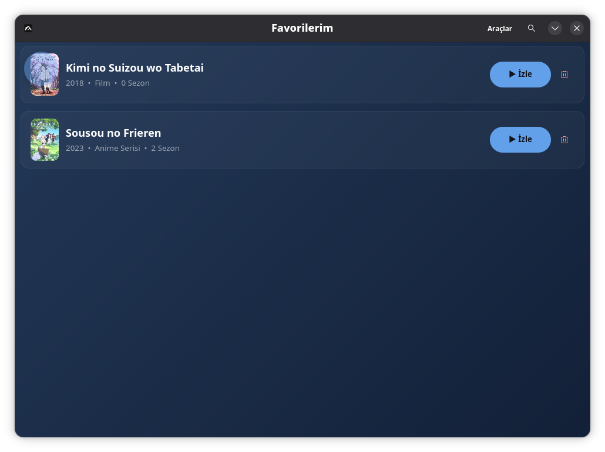
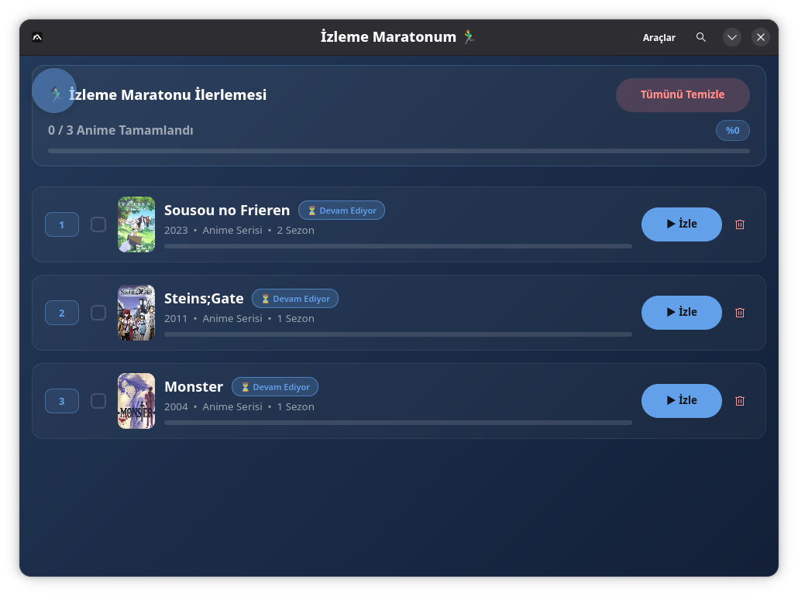
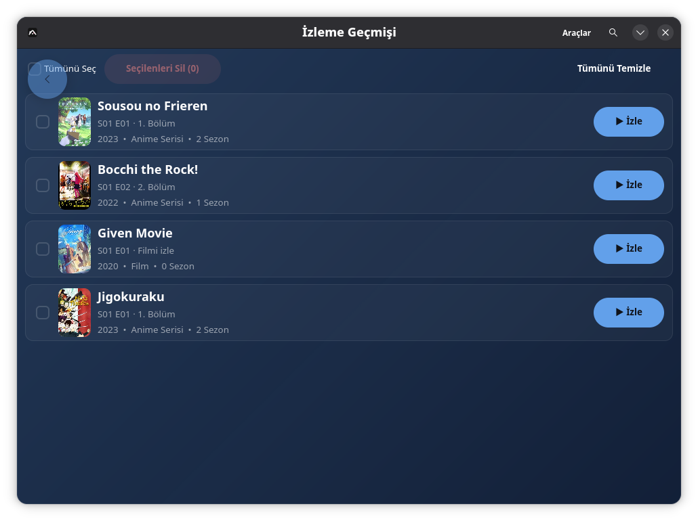
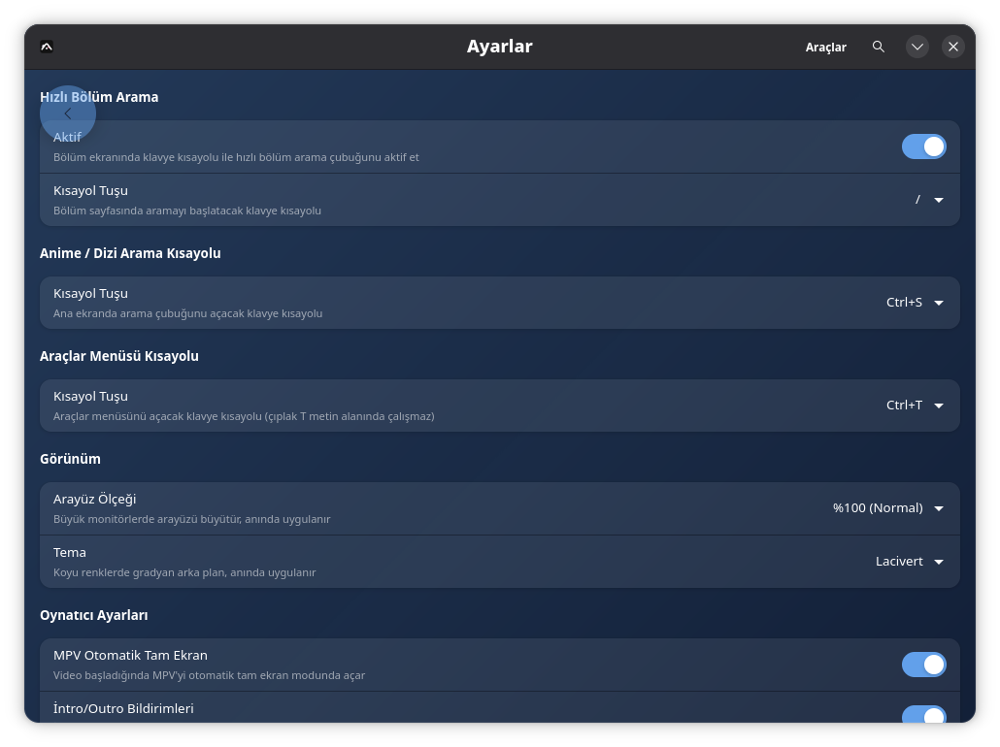
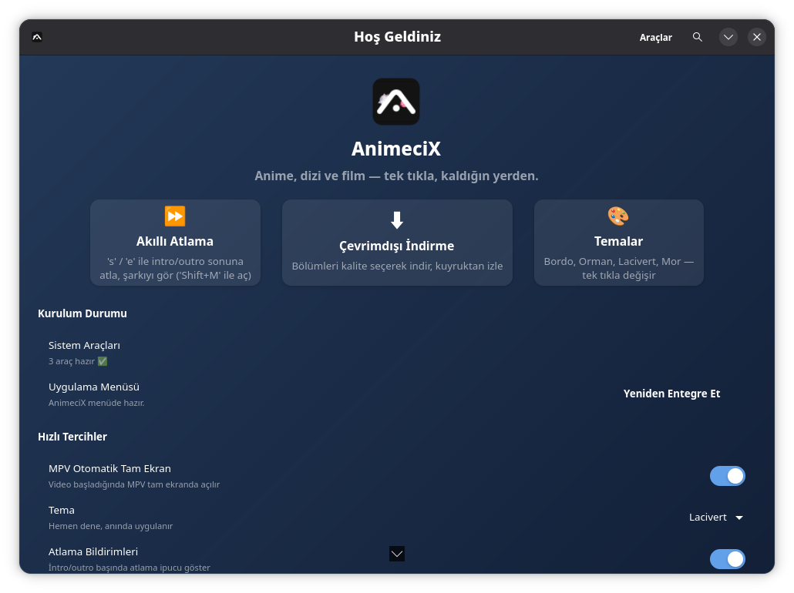

# AnimeciX


**Linux için GTK4/libadwaita ile yazılmış anime, dizi ve film izleme masaüstü istemcisi.**

Tek dosyalık taşınabilir **AppImage** olarak dağıtılır; uygulama başlatmada yeni sürümü
kontrol eder ve kendini otomatik güncelleyebilir.

> ⚠️ Bu uygulama **gayriresmî** ve eğitim/kişisel kullanım amaçlıdır; herkese açık bir API
> kullanır. Hizmet sağlayıcıya zarar vermeden, kendi sorumluluğunda kullanın.

---

## Özellikler

- 🏠 **Ana Sayfa**: kategorilere göre anime/dizi/film listeleri
- 🔎 **Arama**: ana ekranda kısayol tuşu ile hızlı arama; bölüm ekranında hızlı bölüm arama
- ▶️ **Oynatıcı**: MPV ile oynatma, 2 dakikalık önbellek, otomatik tam ekran, **AniSkip** intro/outro atlama
- ⭐ **Favoriler**: beğendiğin başlıkları koleksiyonuna ekle
- 🏃 **Maraton**: izleme listesi — sürükle-bırak ile sıralama ve bölüm ilerleme takibi
- 🕘 **Geçmiş**: izlediğin bölümlerin geçmişi
- ⚙️ **Ayarlar**: masaüstü başlatıcı entegrasyonu, veri sıfırlama, kısayollar
- 📦 **Kurulum Sihirbazı**: bağımlılık kontrolü ve masaüstü menüsüne kurulum
- 🔄 **Otomatik Güncelleme**: AppImage sürümünde başlatmada kendini günceller
- 🎯 **Akıllı kaynak seçimi**: tüm kaynaklar paralel çözülür, en kalitelisi (dosya boyutuna göre) seçilir;
  ölü/pasif kaynaklar elenir, açılmayan kaynağa denk gelirse sonraki kaynağa kendiliğinden geçer
- 🛡️ **VPN proxy desteği** (isteğe bağlı): yerelde çalışan bir proxy varsa
  (`127.0.0.1:10808`, ör. sing-box + ProtonVPN WireGuard) video trafiğini oradan çıkarır ve
  ISS kısıtlamalarını aşar; proxy kapalıysa uygulama normal çalışır, hiçbir şey bozulmaz
- ⚡ **Hızlı yükleme**: HTTP/2 multiplexing, bağlantı havuzu (keep-alive) ve DNS önbelleği;
  kapak görselleri paralel (12 worker) indirilir

---

## Ekran Görüntüleri

<div align="center">

| | |
|:---:|:---:|
|  |  |
| **🏠 Ana Sayfa** | **🔎 Arama** |
|  |  |
| **▶️ Bölüm İzleme** | **⭐ Favoriler** |
|  |  |
| **🏃 İzleme Maratonu** | **🕘 Geçmiş** |
|  |  |
| **⚙️ Ayarlar** | **👋 Karşılama** |

</div>

---

## Kurulum

### AppImage (önerilen)

1. [Releases](https://github.com/nyx47rd/animecix/releases) sayfasından `AnimeciX-x86_64.AppImage` dosyasını indirin.
2. Çalıştırılabilir yapın ve açın:

   ```bash
   chmod +x AnimeciX-x86_64.AppImage
   ./AnimeciX-x86_64.AppImage
   ```

AppImage tek dosyadır; taşınabilir, kurulum gerektirmez. İstersen masaüstü başlatıcısını
uygulama içindeki **Ayarlar → Masaüstü Başlatıcısını Sistemime Kur** ile ekleyebilirsin.

### Kaynaktan derleme

Gerekli sistem bağımlılıkları:

- **Debian/Ubuntu:** `sudo apt install libgtk-4-dev libadwaita-1-dev mpv pkg-config`
- **Fedora:** `sudo dnf install gtk4-devel libadwaita-devel mpv pkgconf-pkg-config`
- **Arch:** `sudo pacman -S gtk4 libadwaita mpv pkgconf`

Rust (1.74+) kurulu olmalı:

```bash
git clone https://github.com/nyx47rd/animecix.git
cd animecix
cargo build --release
./target/release/animecix
```

---

## Güncelleme

Uygulama bir **AppImage** olarak çalışıyorsa başlangıçta yeni sürümü kontrol eder:

- **Otomatik:** *Ayarlar → Güncelleme → Otomatik Güncelleme* açıkken yeni sürüm bulunursa
  onay kutusu çıkar; “Güncelle ve Yeniden Başlat” deyince indirir, kurar ve uygulamayı yeniden başlatır.
- **Elle:** *Ayarlar → Şimdi Güncelle* ile istediğin an kontrol edebilirsin.
Kaynaktan derlenen sürümde otomatik güncelleme devre dışıdır (sadece AppImage için geçerlidir).

---

## İsteğe bağlı: Daha hızlı video (VPN proxy)

> **Not:** VPN Proxy, Flatpak sürümünde bulunmaz (sandbox, host'ta süreç
> başlatmaya izin vermez). AppImage ve AUR sürümlerinde kullanılabilir.

ISS'n video trafiğini kısıtlıyorsa yerelde bir proxy çalıştırman yeterli: uygulama
`127.0.0.1:10808` portunu görünce mpv video trafiğini **otomatik** oradan geçirir;
proxy yoksa hiçbir şey değişmez (kırılmaz yapı).

Kullanılan araç: [sing-box](https://github.com/SagerNet/sing-box) (root'suz, kullanıcı
alanında çalışır) + [ProtonVPN](https://protonvpn.com) ücretsiz WireGuard config'i.

### Kurulum (tek seferlik, ~2 dakika)

1. **sing-box indir:** [GitHub Releases](https://github.com/SagerNet/sing-box/releases)
   sayfasından **Linux x86_64** (`amd64`) `.tar.gz` dosyasını indir. Arşivi aç ve
   binary'yi koy:
   ```bash
   mkdir -p ~/.local/share/singbox
   tar xzf sing-box-*-linux-amd64.tar.gz
   cp sing-box-*/sing-box ~/.local/share/singbox/
   chmod +x ~/.local/share/singbox/sing-box
   ```
2. **ProtonVPN WireGuard config al:** protonvpn.com → Giriş → **Downloads** →
   "WireGuard configuration" → platform **GNU/Linux** → ücretsiz ülke (ör. NL-FREE) →
   indirilen `.conf` dosyasını şuraya kaydet:
   ```bash
   cp ~/İndirilenler/wireguard-config.conf ~/.local/share/singbox/config.json
   ```
   (Config dosya adı tam olarak `config.json` olmalı.)
3. **Başlat:** Uygulamada **Ayarlar → VPN Proxy → Başlat**'a bas. Durum satırı
   "Çalışıyor"a dönerse hazırsın. (Terminal severler için elle komut:
   `~/.local/share/singbox/sing-box run -c ~/.local/share/singbox/config.json &`)

### Doğrulama

Durum satırı "Çalışıyor" gösteriyorsa mpv, videoları 127.0.0.1:10808 üzerinden
çıkarır. Çıkış IP'ni kontrol etmek için:
```bash
curl -x socks5h://127.0.0.1:10808 https://www.gstatic.com/generate_204 -o /dev/null -w "%{http_code}\n"
```
`204` dönüyorsa tünel aktif demektir.

### Notlar

- Uygulama config'i şu sırayla arar: sing-box binary'sinin yanındaki `config.json`,
  `~/.local/share/singbox/config.json`, `~/vpn-config.json`, `~/sing-box-config.json`.
- Proxy'yi durdurmak için **Ayarlar → VPN Proxy → Durdur**.
- Proxy kapatılırsa uygulama normal bağlantıya döner; hiçbir ayarın bozulmaz.

---

## Geliştiriciler için derleme & yayın

AppImage üretmek ve GitHub Release oluşturmak için:

```bash
# GITHUB_TOKEN (repo için içerik/yayın yetkisi olan PAT) tanımlıysa
# betik sürümü otomatik artırır, derler ve release olarak yayınlar:
export GITHUB_TOKEN=ghp_xxxxxxxx
bash build_appimage.sh
```

`build_appimage.sh` her çalıştığında `Cargo.toml` sürümünü otomatik artırır, `cargo build --release`
çalıştırır ve `GITHUB_TOKEN` tanımlıysa `AnimeciX-x86_64.AppImage` dosyasını
`v<surum>` etiketli bir GitHub Release olarak yükler.

---

## Klavye Kısayolları

| Kısayol | İşlev |
|---|---|
| `/` | Bölüm ekranında hızlı bölüm arama |
| `Ctrl+S` | Ana ekranda arama çubuğunu aç |
| `s` | Oynatıcıda AniSkip ile intro sonuna atla |
| `e` | Oynatıcıda AniSkip ile outro sonuna atla |
| `Esc` | Geri / aramayı kapat |

Kısayollar *Ayarlar* ekranından değiştirilebilir.

---

## Yapılandırma & Veri

Tüm veriler (geçmiş, ayarlar, kapak önbelleği) şurada tutulur:

```
~/.local/share/animecix/
~/.cache/animecix/
```

*Ayarlardan* “Tüm Verileri Sıfırla ve Temizle” ile sıfırlanabilir.

---

## Performans

Uygulama, ağ gecikmesini azaltmak için aşağıdaki teknikleri kullanır:

- **HTTP/2 multiplexing**: Tek TCP/TLS bağlantısı üzerinden çoklu eşzamanlı akış; özellikle
  ana sayfadaki onlarca kapak görselini sıraya sokmadan paralel getirir.
- **Bağlantı havuzu & keep-alive**: Boşta bağlantılar 60sn boyunca sıcak tutulur
  (`pool_idle_timeout`), böylece her istekte tekrar TLS/DNS el sıkışması yapılmaz.
- **DNS önbelleği** (`hickory-dns`): Çözümlenen adresler saklanır, tekrarlı `getaddrinfo`
  engellenir.
- **Brotli sıkıştırma**: JSON yanıtları `br` ile sıkıştırılarak aktarılır.
- **Paralel kapak indirme**: 12 worker ile kapaklar eşzamanlı çekilir (diskte 7 gün önbellekli).
- **Stale-while-revalidate API önbelleği**: Süresi dolmuş veri anında gösterilir, arka planda
  tazelenir; çevrimdışıyken bile eski veri kullanılır.

> Geliştiriciler: `ANIMECIX_BENCH=1 ./target/release/animecix` ile her isteğin süresini
> stderr'a loglayabilir (davranışı etkilemez).

---

## Lisans

[MIT](LICENSE) © 2026 nyx47rd
